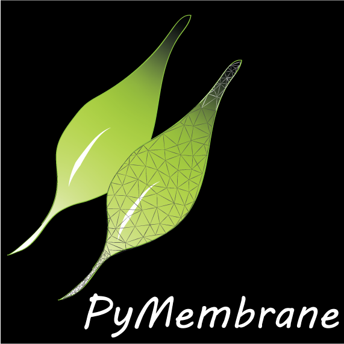

This repository has been updated by Curt Waltmann to inlcude mixed haromonic bending and stretching potentials across nodes of different types. JSON output and input abilities are also included. The most recent version from the original author can be found here https://github.com/fdmatoz/PyMembrane

Patterning of multicomponent elastic shells by gaussian curvature
C Waltmann, A Shrestha, M Olvera de la Cruz
Physical Review E 109 (5), 054409

<p align="center">
  
</p>

# Continuum simulation of elastic membranes

PyMemebrane is a **Python** package for simulating elasticity in thin sheets and membranes. The code is written in **C++** and extensively relies on the [Standard Template Library](https://en.wikipedia.org/wiki/Standard_Template_Library). The C++ backend is exposed to Python with [PyBind11](https://pybind11.readthedocs.io/en/stable/index.html), thus allowing users to run simulation from Python without the need to be familiar with C++. 

The main code is designed using a modular object-oriented approach allowing simple extensions and maintenance.


[Get started now](#getting-started)

[Documentation](https://fdmatoz.github.io/pymembrane/)

## Getting started

In order to use PyMembrane package you need to compile and install it. 

### Dependencies

**Note:** At present, only Linux and Mac OSX are supported. 

You need to clone the code repository from GitHub. Assuming that git is installed on your system, in terminal, please type:

```bash
git clone https://github.com/fdmatoz/pymembrane.git
```

This will make a local copy of the source code in *pymembrane* directory under your current work directory. 

We recommend using [Anaconda](https://www.anaconda.com/products/individual) and creating a PYMEMB environment. To create a new conda environment, in a terminal, type:

```bash
conda create -n PYMEMB python=3.7 numpy scipy matplotlib jupyter jupyterlab pip
```

This should install all packages needed to run the code. Otherwise, in the existing conda environment (PYMEMB) please install these packages:

* cmake
* ipympl
* nodejs

```bash
conda install -c anaconda cmake
```
```bash
conda install -c conda-forge ipympl nodejs
```

Please also install the following extensions for **JupyterLab**:

```bash
jupyter labextension install @jupyter-widgets/jupyterlab-manager jupyter-matplotlib
```

In addition, we assume that you have a working C/C++ compiler that it supports the **C++14** or later standard.

**Note:** If the system-wide C++ compiler is outdated (sometimes the case on HPC clusters), you can install it through [conda](https://anaconda.org/conda-forge/compilers).

### Note on VTK libraries

PyMemebrane relies on the [VTK](https://vtk.org/download/) to produce VTP files that can be visualized with [ParaView](https://www.paraview.org/). There are several known issues with VTK libraries installed through conda. If you are a Linux user, we recommend installing VTK libraries using the system package manager (e.g., apt). You will, however, require root access and will need to install both the library package and the development package (containing header files). 

If VTK libraries are not installed on your system, the PyMembane build scripts will fetch the source code from GitHub and compile it locally. Depending on how powerful you machine is, this might take a bit of time, though. 

Allowing PyMembrane to fetch and compile VTK locally is recommended on Mac OSX. 

### Visualization 

We also recommend that you install [Paraview](https://www.paraview.org/) which will allow you to visualize the mesh files and their attributes. Binary packages are available for most Linux distributions as well as for Mac OS X.

### Installing pymembrane Python module 

In order allow Python to load the pymembrane module without the need to toy with search paths, from the **``pymembrane``**  directory run:

``python setup.py install``

**Note:** If you are not running anaconda, but using Python installed on your system, you will beed root access. At present, due to technical issues, the 'python setup.py install --user' option does not work. 

## Quick start: Disclination problem

Please refer to the [basic example](./docs/Examples/desclination.md).


## About the project

PyMemebrane is &copy; 2020-{{ "now" | date: "%Y" }} by [Daniel Matoz Fernandez](http://www.danielmatoz.com).

### License

PyMemebrane is distributed by an [MIT license](https://github.com/fdmatoz/just-the-docs/tree/master/LICENSE.txt).
