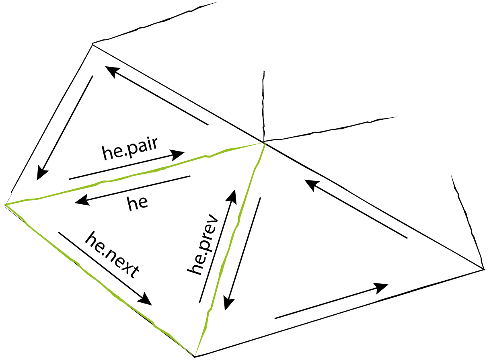

# Disclination

{: .no_toc }

This example show how to load a mesh, initialize the system and perform basic operation over meshes.

<dl>
  <dt>By</dt>
  <dd>Daniel Matoz Fernandez</dd>
  <dt>Type</dt>
  <dd>None</dd>
</dl>


---

```python
#import the code
import pymembrane as mb
import numpy as np
```

Create a system:

```python
system = mb.System()
#read the mesh
vertex_file = 'vertices.inp'
face_file = 'faces.inp'
system.read_mesh_from_files(files={'vertices':vertex_file, 'faces':face_file})
```

    Mesh
     Numvertices  7
     NumFaces  6
     NumEdges  12
     NumHEdges  24

Create dumper object and dump the mesh:

```python
dump = system.dump()
dump.vtk("initial_mesh")
```

# Halfedge structures



If you want to extract the vertices we do the following

```python
vertices = system.getVertices()
```

lets take a look at them

```python
for vertex in vertices:
    print(vertex.r)
```

    [0.000000000000000,0.000000000000000,0.000000000000000]
    [1.000000000000000,0.000000000000000,0.000000000000000]
    [0.500000000000000,0.866025403800000,0.000000000000000]
    [-0.500000000000000,0.866025403800000,0.000000000000000]
    [-1.000000000000000,0.000000000000000,0.000000000000000]
    [-0.500000000000000,-0.866025403800000,0.000000000000000]
    [0.500000000000000,-0.866025403800000,0.000000000000000]

No much information there since is a complex data structure lets get some help:

```python

help(vertices[0])
```

    Help on Vertex in module pymembrane.cppmodule.cppmodule object:

    class Vertex(pybind11_builtins.pybind11_object)
     |  Method resolution order:
     |      Vertex
     |      pybind11_builtins.pybind11_object
     |      builtins.object
     |
     |  Methods defined here:
     |
     |  __init__(self, /, *args, **kwargs)
     |      Initialize self.  See help(type(self)) for accurate signature.
     |
     |  ----------------------------------------------------------------------
     |  Data descriptors defined here:
     |
     |  boundary
     |      Vertex True if it is at the boundary
     |
     |  coordination
     |      Vertex Coordination
     |
     |  energy
     |      Conservative Energy
     |
     |  forceC
     |      Conservative Force
     |
     |  forceD
     |      Dissipative Force
     |
     |  id
     |      Vertex id
     |
     |  mass
     |      mass
     |
     |  normal
     |      normal
     |
     |  property
     |      Properties
     |
     |  r
     |      Vertex position
     |
     |  type
     |      type
     |
     |  v
     |      Vertex velocity
     |
     |  ----------------------------------------------------------------------
     |  Static methods inherited from pybind11_builtins.pybind11_object:
     |
     |  __new__(*args, **kwargs) from pybind11_builtins.pybind11_type
     |      Create and return a new object.  See help(type) for accurate signature.

Now try to print the positions of the vertices by doing:

```python
for vertex in vertices:
    print(vertex.r , "or a list ", vertex.r.list())
```

    [0.000000000000000,0.000000000000000,0.000000000000000] or a list  [0.0, 0.0, 0.0]
    [1.000000000000000,0.000000000000000,0.000000000000000] or a list  [1.0, 0.0, 0.0]
    [0.500000000000000,0.866025403800000,0.000000000000000] or a list  [0.5, 0.8660254038, 0.0]
    [-0.500000000000000,0.866025403800000,0.000000000000000] or a list  [-0.5, 0.8660254038, 0.0]
    [-1.000000000000000,0.000000000000000,0.000000000000000] or a list  [-1.0, 0.0, 0.0]
    [-0.500000000000000,-0.866025403800000,0.000000000000000] or a list  [-0.5, -0.8660254038, 0.0]
    [0.500000000000000,-0.866025403800000,0.000000000000000] or a list  [0.5, -0.8660254038, 0.0]

For the faces we do the same

```python
faces = system.getFaces()
for face in faces:
    print(face.v1, face.v2, face.v3, face.refmetric())
help(faces[0])
```

    0 1 2 [0.0, 0.0, 0.0]
    0 2 3 [0.0, 0.0, 0.0]
    0 3 4 [0.0, 0.0, 0.0]
    0 4 5 [0.0, 0.0, 0.0]
    0 5 6 [0.0, 0.0, 0.0]
    0 6 1 [0.0, 0.0, 0.0]
    Help on Face in module pymembrane.cppmodule.cppmodule object:

    class Face(pybind11_builtins.pybind11_object)
     |  Method resolution order:
     |      Face
     |      pybind11_builtins.pybind11_object
     |      builtins.object
     |
     |  Methods defined here:
     |
     |  __init__(self, /, *args, **kwargs)
     |      Initialize self.  See help(type(self)) for accurate signature.
     |
     |  metric(...)
     |      metric(self: pymembrane.cppmodule.cppmodule.Face, arg0: List[pymembrane.cppmodule.cppmodule.real3]) -> List[float]
     |
     |      get the metric
     |
     |  refmetric(...)
     |      refmetric(self: pymembrane.cppmodule.cppmodule.Face) -> List[float]
     |
     |      get the reference metric
     |
     |  set_refmetric(...)
     |      set_refmetric(*args, **kwargs)
     |      Overloaded function.
     |
     |      1. set_refmetric(self: pymembrane.cppmodule.cppmodule.Face, arg0: List[float]) -> None
     |
     |      set the reference metric to [g11, g12, g22]
     |
     |      2. set_refmetric(self: pymembrane.cppmodule.cppmodule.Face, arg0: List[pymembrane.cppmodule.cppmodule.real3]) -> None
     |
     |      set the reference metric to [v1, v2, v3] vertices with v1 being real3
     |
     |      3. set_refmetric(self: pymembrane.cppmodule.cppmodule.Face, arg0: List[pymembrane.cppmodule.cppmodule.real3], arg1: pymembrane.cppmodule.cppmodule.box) -> None
     |
     |      set the reference metric to [v1, v2, v3] vertices with v1 being real3 and a Box considering periodic boundary conditions
     |
     |  ----------------------------------------------------------------------
     |  Data descriptors defined here:
     |
     |  area
     |      area of the face
     |
     |  boundary
     |      True if it is at the boundary
     |
     |  energy
     |      Conservative Energy
     |
     |  id
     |      face id
     |
     |  normal
     |      normal to that face
     |
     |  nsides
     |      number of sides face has
     |
     |  outer
     |      if True, face is a ghost outer face
     |
     |  property
     |      properties
     |
     |  reference_normal
     |      reference normal to that face
     |
     |  type
     |      types
     |
     |  v1
     |      one of vertices that define the face
     |
     |  v2
     |      one of vertices that define the face
     |
     |  v3
     |      one of vertices that define the face
     |
     |  ----------------------------------------------------------------------
     |  Static methods inherited from pybind11_builtins.pybind11_object:
     |
     |  __new__(*args, **kwargs) from pybind11_builtins.pybind11_type
     |      Create and return a new object.  See help(type) for accurate signature.

# Compute methods

**PyMembrane** ships with some basic computation methods to help you to know more about the geometrical properties of the mesh. For calculate the edge lenghts, for example, we can use the system class compute as follows:

```python
compute = system.compute_mesh()
help(compute)
```

    Help on ComputeMesh in module pymembrane.cppmodule.cppmodule object:

    class ComputeMesh(pybind11_builtins.pybind11_object)
     |  Method resolution order:
     |      ComputeMesh
     |      pybind11_builtins.pybind11_object
     |      builtins.object
     |
     |  Methods defined here:
     |
     |  __init__(...)
     |      __init__(self: pymembrane.cppmodule.cppmodule.ComputeMesh, arg0: pymembrane.cppmodule.cppmodule.System) -> None
     |
     |  edge_lengths(...)
     |      edge_lengths(self: pymembrane.cppmodule.cppmodule.ComputeMesh) -> List[float]
     |
     |
     |      Compute the edge lengths
     |
     |  face_area(...)
     |      face_area(self: pymembrane.cppmodule.cppmodule.ComputeMesh) -> List[float]
     |
     |
     |      Compute the face area.
     |
     |  face_metric(...)
     |      face_metric(self: pymembrane.cppmodule.cppmodule.ComputeMesh) -> List[List[float]]
     |
     |
     |      Compute the face metric.
     |
     |  face_normals(...)
     |      face_normals(self: pymembrane.cppmodule.cppmodule.ComputeMesh) -> None
     |
     |
     |      Compute face normals and store it in the face.normal
     |
     |  mesh_area(...)
     |      mesh_area(self: pymembrane.cppmodule.cppmodule.ComputeMesh) -> float
     |
     |
     |      Compute the mesh area.
     |
     |  mesh_energy(...)
     |      mesh_energy(self: pymembrane.cppmodule.cppmodule.ComputeMesh, evolver: pymembrane.cppmodule.cppmodule.Evolver) -> Dict[str, List[float]]
     |
     |
     |      Compute the energy of the mesh defined in evolver argument
     |
     |  mesh_volume(...)
     |      mesh_volume(self: pymembrane.cppmodule.cppmodule.ComputeMesh) -> float
     |
     |
     |      Compute the mesh volume. Need close surfaces
     |
     |  vertex_normals(...)
     |      vertex_normals(self: pymembrane.cppmodule.cppmodule.ComputeMesh, vertex_normal_angle_weight: bool = False) -> None
     |
     |
     |      Compute vertex normals and store it in the vertex.normal
     |
     |  gaussian_curvature(...)
     |      gaussian_curvature(self: pymembrane.cppmodule.cppmodule.ComputeMesh) -> List[float]
     |
     |
     |      Compute the gaussian curvature
     |
     |  mean_curvature(...)
     |      mean_curvature(self: pymembrane.cppmodule.cppmodule.ComputeMesh) -> List[float]
     |
     |
     |      Compute the mean curvature
     |
     |  ----------------------------------------------------------------------
     |  Static methods inherited from pybind11_builtins.pybind11_object:
     |
     |  __new__(*args, **kwargs) from pybind11_builtins.pybind11_type
     |      Create and return a new object.  See help(type) for accurate signature.

```python
edge_lengths = compute.edge_lengths()
avg_edge_length= np.mean(edge_lengths)
print("avg_edge_length = ", avg_edge_length)
```

    avg_edge_length =  1.0000000000089846

Download the [**script**](../../attached/hexagon.py), [**initial vertice file**](../../attached/vertices.inp), [**initial face file**](../../attached/faces.inp).
