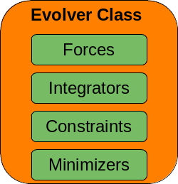

# Evolver class
{: .no_toc }

**Pymembrane** uses an evolver class to setup the simulations. The ***Evolver*** contains all the information needed to load forces, integrators, constraints and minimizers (see figure). 



{: .fs-6 .fw-300 }

## Table of contents
{: .no_toc .text-delta }

1. TOC
{:toc}

---

### Creating an evolver class


```python
import pymembrane as mb
# create a new system instance
system = mb.System()
vertex_file = 'hexagon_vertices.inp'
face_file = 'hexagon_faces.inp'
system.read_mesh_from_files(files={'vertices':vertex_file, 'faces':face_file})

# create the evolver class
evolver = mb.Evolver(system)
```

### Evolver methods
add_constraint(...)
```add_constraint(self: pymembrane.cppmodule.cppmodule.Evolver, arg0: str, arg1: Dict[str, str]) -> None```  add constraint method

add_force(...)
1. ```add_force(self: pymembrane.cppmodule.cppmodule.Evolver, arg0: str, arg1: Dict[str, Dict[str, str]]) -> None```
2. ```add_force(self: pymembrane.cppmodule.cppmodule.Evolver, arg0: str, arg1: Dict[str, Dict[Tuple[str, str], str]]) -> None```

add_integrator(...)
```add_integrator(self: pymembrane.cppmodule.cppmodule.Evolver, arg0: str, arg1: Dict[str, str]) -> None```

compute_mesh_energy(...)
```compute_mesh_energy(self: pymembrane.cppmodule.cppmodule.Evolver) -> None``` compute the mesh energy and store in the mesh

compute_mesh_forces(...)
```compute_mesh_forces(self: pymembrane.cppmodule.cppmodule.Evolver) -> None``` compute the mesh forces and store in the mesh

```delete_force(self: pymembrane.cppmodule.cppmodule.Evolver, arg0: str) -> None``` delete force method

```delete_integrator(self: pymembrane.cppmodule.cppmodule.Evolver, arg0: str) -> None``` delete integrator method

```enforce_mesh_constraints(self: pymembrane.cppmodule.cppmodule.Evolver) -> None``` enforce constraint method

```evolveMC(self: pymembrane.cppmodule.cppmodule.Evolver, arg0: int) -> int``` Evolve the mesh following Monte Carlos methods loaded. Arg: steps Return: accepted moves

```evolveMD(self: pymembrane.cppmodule.cppmodule.Evolver) -> None``` evolve the mesh following Molecular Dynamics methods loaded

```reset_mesh_energy(self: pymembrane.cppmodule.cppmodule.Evolver) -> None``` reset the mesh energy

```reset_mesh_forces(self: pymembrane.cppmodule.cppmodule.Evolver) -> None``` reset the mesh forces

set(...) : set/modify properties for integrartors/forces/minimizers/constraints
1. ```set(self: pymembrane.cppmodule.cppmodule.Evolver, arg0: str, arg1: Dict[str, Dict[Tuple[str, str], str]]) -> None```
2. ```set(self: pymembrane.cppmodule.cppmodule.Evolver, arg0: str, arg1: Dict[str, Dict[str, str]]) -> None```
3. ```set(self: pymembrane.cppmodule.cppmodule.Evolver, arg0: str, arg1: Dict[str, str]) -> None```

```set_global_temperature(self: pymembrane.cppmodule.cppmodule.Evolver, arg0: str) -> None``` set the temperature in the whole system

```set_time_step(self: pymembrane.cppmodule.cppmodule.Evolver, arg0: str) -> None``` set the time step for Molecular Dynamics methods