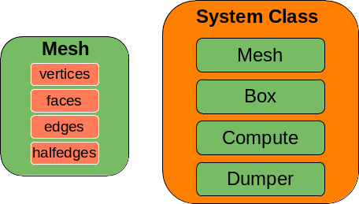
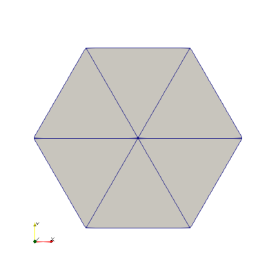

# System class

{: .no_toc }

**Pymembrane** uses a system class to load meshes. The system contains all the information needed to load meshes, save meshes and compute mesh properties (see figure).


{: .fs-6 .fw-300 }

## Table of contents

{: .no_toc .text-delta }

1. TOC
{:toc}

---

```python
# import pymembrane
import pymembrane as mb

# create a new system instance
system = mb.System()
```

### Loading my first mesh

**Pymembrane** work with meshes in _inp_ format. For example, a vertex file for an hexagon looks like:

Vertex File (id x y z type):

0 0.0 0.0 0.0 1  
 1 1.0 0.0 0.0 1  
 2 0.5 0.8660254038 0.0 1  
 3 -0.5 0.8660254038 0.0 1  
 4 -1.0 0.0 0.0 1  
 5 -0.5 -0.8660254038 0.0 1  
 6 0.5 -0.8660254038 0.0 1

and the corresponding face file:

Face File (id v1 v2 v3 normal):

0 0 1 2 1  
 1 0 2 3 1  
 2 0 3 4 1  
 3 0 4 5 1  
 4 0 5 6 1  
 5 0 6 1 1

Now that we have the faces and vertices files we can create a mesh as follows:

```python
vertex_file = 'vertices.inp'
face_file = 'faces.inp'
system.read_mesh_from_files(files={'vertices':vertex_file, 'faces':face_file})
```

## Visualization

**Pymembrane** can export meshes to [_vtk_](https://en.wikipedia.org/wiki/VTK)
and [_ply_](<https://en.wikipedia.org/wiki/PLY_(file_format)>) files. To create a dumper for a given mesh we need to do:

```python
dump = system.dump()
dump.ply("hexagon")      #for ply
dump.vtk("hexagon")      #for vtk
```



In addition _vtk_ format can be set to legacy format by:

```python
dump.setvtkLegacyFormat(True)
```

<small>Note:
_VTK_ and _json_ format is desirable since all the properties of the mesh are fully exported.
</small>

## Data structures

**PyMembrane** uses [halfedge data structures](https://en.wikipedia.org/wiki/Doubly_connected_edge_list) for representing meshes.

### Looping over vertices

As an example lets say that we want to deform the mesh that we just loaded. To do that we need to access to the vertices in the **_system_** class as follows:

```python
# Retrieve the vertices
vertices = system.getVertices()
for index in range(len(vertices)):
    vertex = vertices[index]
    vertex.r.x+=0.1
    vertex.r.y-=0.3
    vertices[index] = vertex

# Set the new vertices
system.setVertices(vertices)

# Now we can visualize new mesh
dump.vtk("hexagon_vertex_move")      #for vtk
```

#### Vertex methods

`boundary` Vertex True if it is at the boundary

`coordination` Vertex Coordination

`energy` Conservative Energy

`forceC` Conservative Force

`forceD` Dissipative Force

`id` Vertex id

`mass` mass

`normal` normal

`property` Properties

`r` Vertex position

`type` type

`v` Vertex velocity

### Looping over faces

As an example lets say that we want to change the face type in mesh that we just loaded. To do that we need to access to the faces in the **_system_** class as follows:

```python
# Retrieve the vertices
faces = system.getFaces()
for index in range(len(faces)):
    face = faces[index]
    face.type = 3
    faces[index] = face

# Set the new faces
system.setFaces(faces)

# Now we can visualize new mesh
dump.vtk("hexagon_face_type")      #for vtk
```

#### Face methods

`area` area of the face

` boundary` True if it is at the boundary

` energy` Conservative Energy

` id` face id

` normal` normal to that face

` nsides` number of sides face has

` outer` if True, face is a ghost outer face

` property` properties

` reference_normal` reference normal to that face

` type` types

` v1` one of vertices that define the face

` v2` one of vertices that define the face

` v3` one of vertices that define the face

### Looping over edges and halfedges

```python
edges = system.getEdges()
for index in range(len(edges)):
    edge = edges[index]
    ...
system.setEdges(edges)
```

#### Edge methods

` boundary` True if it is at the boundary

` energy` Conservative Energy

` face_k` index to one of the faces shared by this edge -1 if is outer face

` face_l` index to one of the faces shared by this edge -1 if is outer face

` i` one of the conected vertices

` id` id

` j` one of the conected vertices

` property` Properties

` type` type

` v0` vertex around the edge

` v1` vertex around the edge

` v2` vertex around the edge

` v3` vertex around the edge

```python
halfedges = system.getHalfedges()
for index in range(len(halfedges)):
    halfedge = halfedges[index]
    ...
```

#### Halfedge methods

` boundary` if true, the halfedge is a boundary

` edge` edge this he is part of

` face` face the half-edge borders

` index` vertex at the beginning of the half-edge

` next` next half-edge around the face

` pair` oppositely oriented adjacent half-edge

` prev` previous half-edge around the face

` vert_from` vertex at the beginning of the half-edge

` vert_to` vertex at the end of the half-edge
